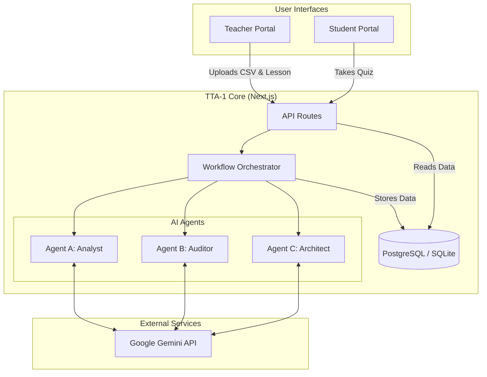

# KAGGLE-GOOGLE: The Teacher's Teacher Assistant (TTA-1)

A comprehensive solution for the Google Generative AI Capstone, designed to empower teachers with AI-driven insights and automated lesson improvements.

## 🚩 Problem

Teachers today face significant challenges in personalizing education:
- **Data Overload**: Analyzing student performance data across multiple topics and students is time-consuming and complex.
- **One-Size-Fits-All**: Creating personalized lesson plans and practice materials for every student's unique needs is practically impossible manually.
- **Curriculum Alignment**: Ensuring every lesson meets strict curriculum standards requires constant, meticulous auditing.

## 💡 Solution

**TTA-1 (The Teacher's Teacher Assistant)** is a multi-agent AI system that acts as a force multiplier for educators. It leverages Google's Gemini API to automate the analysis, auditing, and improvement of teaching materials.

### Key Features
- **🤖 Multi-Agent Workflow**:
    - **Agent A (Insight Analyst)**: Ingests student performance CSV data to identify class-wide trends and at-risk students.
    - **Agent B (Curriculum Auditor)**: Audits lesson plans against curriculum standards to find gaps.
    - **Agent C (Content Architect)**: Automatically rewrites and improves lesson content to address identified weaknesses.
- **🔄 Iterative Refinement**: The system automatically iterates on lesson plans until they meet a high-quality threshold (80%+).
- **🎓 Student Portal**: A dedicated interface for students to access personalized practice materials and adaptive quizzes generated by AI.
- **📊 Analytics Dashboard**: Visualizes progress and performance trends for both teachers and students.

## 🏗️ Architecture

This project is built as a **Turborepo** monorepo, ensuring modularity and scalability.



### Tech Stack
- **Framework**: Next.js 14 (App Router)
- **Language**: TypeScript
- **Styling**: Tailwind CSS, Shadcn UI
- **Database**: Prisma ORM (SQLite for dev, PostgreSQL for prod)
- **AI Model**: Google Gemini Pro / Flash
- **Authentication**: NextAuth.js v5
- **Monorepo Tool**: Turborepo
- **Package Manager**: pnpm

## 🚀 Getting Started

### Prerequisites
- Node.js >= 18
- pnpm >= 9.0.0
- A Google Gemini API Key ([Get one here](https://ai.google.dev/))

### Installation

1. **Clone the repository**
   ```bash
   git clone https://github.com/rrrr08/KAGGLE-GOOGLE.git
   cd KAGGLE-GOOGLE
   ```

2. **Install dependencies**
   ```bash
   pnpm install
   ```

3. **Configure Environment Variables**
   Create a `.env.local` file in `apps/tta-1/`:
   ```bash
   # apps/tta-1/.env.local
   DATABASE_URL="file:./dev.db"
   GEMINI_API_KEY="your-gemini-api-key"
   NEXTAUTH_SECRET="your-secret-key"
   ```

4. **Initialize Database**
   ```bash
   cd apps/tta-1
   npx prisma generate
   npx prisma db push
   cd ../..
   ```

### Running the Application

To run the entire monorepo (all apps):
```bash
pnpm dev
```

To run only the **TTA-1** application:
```bash
cd apps/tta-1
pnpm dev
```
The application will be available at `http://localhost:3003`.

## 📖 Usage Guide

### For Teachers
1. **Log in** to the Teacher Portal.
2. **Create a Class** and share the class code with students.
3. **Upload Data**: Go to the "Analysis" tab and upload a CSV file containing student scores (sample provided in `public/sample.csv`).
4. **Generate Lessons**: Input your current lesson plan. The AI agents will analyze the data and your lesson, then generate an improved version tailored to your class's needs.

### For Students
1. **Sign Up** using the class code provided by the teacher.
2. **Dashboard**: View your personalized dashboard highlighting weak topics.
3. **Practice**: Click on a topic to generate AI-powered practice problems.
4. **Quiz**: Take adaptive quizzes to test your knowledge and track improvement.

## 📂 Project Structure

```
KAGGLE-GOOGLE/
├── apps/
│   ├── tta-1/          # Main Application (Teacher & Student Portals)
│   ├── web/            # Landing Page / Web App
│   ├── docs/           # Documentation Site
│   └── agent/          # Python-based AI services (optional)
├── packages/
│   ├── ui/             # Shared UI components
│   ├── eslint-config/  # Shared ESLint configuration
│   └── typescript-config/ # Shared TypeScript configuration
└── ...
```

## 📄 License

MIT
